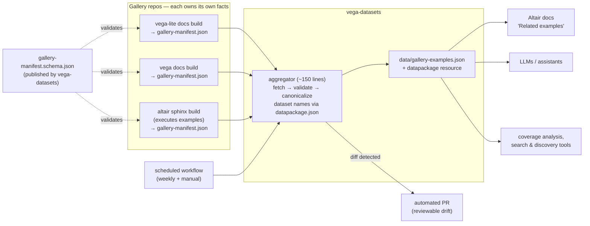

# Design: A Federated Gallery-Examples Index for the Vega Ecosystem

**Status:** Proposal (blue-sky design)
**Context:** [vega/vega-datasets#776](https://github.com/vega/vega-datasets/pull/776) (draft), superseding [#724](https://github.com/vega/vega-datasets/pull/724); related: [vega/altair#4002](https://github.com/vega/altair/issues/4002)
**Date:** 2026-07-19

---

## 1. Problem

There is no machine-readable answer to two symmetric questions:

- *"Which gallery examples use dataset X?"* — needed for "Related examples"
  features in docs (altair#4002), for coverage-gap analysis ("which datasets
  have no examples? which features lack examples?"), and for deciding when a
  dataset can be deprecated.
- *"Which datasets does example Y use?"* — needed by AI assistants and search
  tools to ground generated charts in real, tested examples, and by learners
  browsing by data domain.

PR #776 answers both by **scraping** the three galleries from vega-datasets:
fetch Vega-Lite's and Vega's site index files, list Altair's example directory
via the GitHub API, then regex/heuristic-extract dataset references from specs
and Python source. It works — 399 records today — but the review discussion
surfaced structural tensions worth designing around rather than into:

1. **Fragility by construction.** The scraper parses *presentation-layer*
   artifacts (site `_data/examples.json`, Python docstrings, `# category:`
   comments). Every upstream restructuring is a potential silent breakage,
   which is why the PR grew count-floor canaries, empty-category fallbacks,
   description-rescue logic, and three separate Altair regex families — and
   why the network smoke test had to be removed (expected upstream churn made
   it noisy).
2. **The wrong party does the extraction.** As noted in altair#4002, only
   Altair can reliably compute which datasets its examples use: compiled specs
   inline data as `values`, so the scraper falls back to source-level regex
   over Python conventions. The same is true in kind (if less in degree) for
   Vega-Lite and Vega: the doc builds of those repos already parse every spec;
   the information exists upstream and is re-derived downstream, worse.
3. **Freshness is coupled to vega-datasets releases.** Galleries change
   weekly; vega-datasets releases rarely. A snapshot regenerated manually at
   release time is stale most of its life, and there is no defined process for
   *when* regeneration happens.
4. **Identity is fragile.** `spec_url` as primary key means a branch rename or
   directory move upstream rewrites every key. Meanwhile joelostblom made an
   explicit stability promise about a *different* URL: gallery page URLs
   (`example_url`) will survive reorganization. The design should key on the
   thing upstream promises to keep stable.

## 2. Goals and non-goals

**Goals**

- G1. A queryable example↔dataset index covering Vega, Vega-Lite, and Altair,
  distributed with vega-datasets (npm/jsdelivr/PyPI) like any other resource.
- G2. Extraction accuracy that comes from ground truth (the running doc
  builds), not from pattern-matching presentation artifacts.
- G3. Freshness on the order of days, decoupled from vega-datasets releases,
  with upstream drift surfacing as a *reviewable diff*, not a red CI run or a
  silent regression.
- G4. Stable identity for examples so downstream consumers (Altair docs,
  LLM indexes, bookmarking tools) can hold references across regenerations.
- G5. An incremental migration path: value on day one with zero upstream
  changes, strictly less code as each upstream adopts.

**Non-goals**

- Visualization-technique taxonomy or spec feature detection (deliberately cut
  between #724 and #776; stays cut — categories come from the galleries'
  own curation).
- Indexing third-party galleries or examples that use no vega-datasets data
  (they may appear in upstream manifests; the aggregate records them with an
  empty `datasets` list rather than dropping them — absence of data is itself
  useful for coverage analysis).
- A runtime service. This is a static data artifact; anything live (search
  API, MCP server) is a consumer, not part of this design.

## 3. Proposed architecture: publish manifests upstream, aggregate downstream

Invert the data flow. Instead of vega-datasets reaching *into* three repos and
reverse-engineering their doc builds, each gallery-owning repo **publishes a
small, schema-validated manifest as a byproduct of the doc build it already
runs**, and vega-datasets runs a thin aggregator that validates, canonicalizes
dataset names, merges, and commits.



### Why the boundary sits exactly here

Each side does the one thing only it can do reliably:

- **Upstream repos** know their example inventory, titles, descriptions,
  categories, thumbnails, and — crucially — the *actual* data URLs their
  examples load, computed at build time (Vega-Lite's build parses every spec;
  Altair's sphinx build executes every example, so `chart.to_dict()` yields
  the real URL before any inlining). No regex, no docstring parsing, no
  GitHub-API directory listing.
- **vega-datasets** owns the canonical dataset namespace (`datapackage.json`
  resource names) and is the natural join point. Mapping
  `https://cdn.jsdelivr.net/npm/vega-datasets@3.2.1/data/cars.json` → `cars`
  is the only transformation the aggregator performs on upstream facts.

This directly implements what dsmedia proposed in altair#4002 ("persist the
sphinx-computed metadata to a JSON file so any consumer can map examples
without reimplementing the detection logic") and what joelostblom offered
("happy to reorganize if it helps, provided URLs remain unchanged").

## 4. The manifest contract: a *gallery index*, not a dataset index

The schema must be additive to the gallery-owning projects on their own
terms — a normalization of gallery data they already maintain and duplicate —
or the whole federation idea is the cart leading the horse. So the contract is
deliberately framed as a **gallery index schema**: its center of gravity is
the gallery domain (inventory, navigation, presentation), and dataset usage is
one *optional* facet that vega-datasets happens to consume.

A single JSON Schema, `gallery-index.schema.json`, versioned; proposed to the
vega org as an RFC issue rather than imposed from vega-datasets (the schema
`$id` URL — ideally `https://vega.github.io/schema/gallery-index/v1.json`,
matching existing conventions — is the contract, not the repo it lives in).
Draft shape:

```jsonc
{
  "$schema": "https://vega.github.io/schema/gallery-index/v1.json",
  "gallery": {
    "name": "vega-lite",                    // enum: vega | vega-lite | altair
    "url": "https://vega.github.io/vega-lite/examples/",
    "libraryVersion": "6.4.0",
    "sourceRevision": "v6.4.0",             // REQUIRED: tag or commit SHA of the
                                            // source tree this index was built
                                            // from — lets static consumers pin
                                            // spec downloads to an immutable
                                            // revision instead of a live branch
    "generatedAt": "2026-07-18T04:12:09Z"
  },
  "examples": [
    {
      // ---- required core: the intersection of what all three galleries
      // ---- already have today
      "id": "bar",                          // slug, unique within gallery; the
                                            // ONLY hard stability promise
      "title": "Simple Bar Chart",
      "categories": ["Single-View Plots", "Bar Charts"],
      "pageUrl": "https://vega.github.io/vega-lite/examples/bar.html",
      "specUrl": "https://raw.githubusercontent.com/vega/vega-lite/main/examples/specs/bar.vl.json",
      "specFormat": "vega-lite",            // vega | vega-lite | altair-python

      // ---- optional facets
      "description": "A bar chart encodes quantitative values as…",
      "thumbnailUrl": "https://vega.github.io/vega-lite/examples/bar.svg",
      "data": [                             // OPTIONAL — see below
        { "url": "data/cars.json", "role": "primary" }   // primary | lookup | geo
      ],
      "display": { "style": "background-size: auto 105%;", "png": true }
                                            // pass-through presentation hints,
                                            // schema-opaque, gallery-owned
    }
  ]
}
```

Design points:

- **`(gallery.name, example.id)` is the global primary key** of the aggregate.
  The slug is derived from the gallery page URL — the identifier upstream has
  promised to keep stable — so keys survive branch renames, directory moves,
  and spec-format migrations that would rewrite every `spec_url`. `specUrl`
  remains a required, unique field (useful for fetching source), it just
  stops being identity.
- **The required core is only what every gallery already has.** Slug, title,
  categories, page/spec locations, and thumbnails all exist in all three
  builds today. Nothing in the required set asks a gallery to *compute*
  anything new — only to serialize what it has in one normalized shape.
- **`data[]` is optional, and only Altair is asked to fill it.** For Vega and
  Vega-Lite, specs are declarative JSON, and downstream extraction of data
  URLs is cheap and robust (that part of the #776 scraper is *not* the
  fragile part — the fragile parts are index-structure guessing and Altair
  source-regex). Only Altair's build can know its data URLs reliably
  (compiled specs inline data), and persisting that is *Altair's own open
  request* (altair#4002), not new work created by this design. Where present,
  `data[]` carries raw URLs, never vega-datasets names — canonicalization is
  the aggregator's job — and `role` distinguishes primary from lookup/topo
  references, which upstream knows from context and downstream cannot recover.
- **`display` is a schema-opaque pass-through** for the presentation fields
  galleries already keep (`style`, `png` in vega-lite's `examples.json`).
  This matters for adoption: it means the index can *replace* the
  hand-maintained file as the site template's source of truth rather than
  becoming a second file to keep in sync (see §4.2).
- **`thumbnailUrl` is first-class** because the flagship consumer use case
  (altair#4002 "Related gallery examples" sections) needs it, and only the
  gallery build knows where its thumbnails live. Its stability tier is
  explicitly *weaker* than `id`/`pageUrl`: thumbnails are best-effort URLs
  valid as of `generatedAt`, and consumers that need durability snapshot them
  at build time (see §4.4) rather than hotlinking.
- **`id` is identity, not a filename.** Consumers must not assume `id`,
  spec filename, route segment, and thumbnail basename are interchangeable —
  the Vega Editor's current `spec.name` does exactly that triple duty, which
  is why upstream file moves are breaking changes for it today. The schema
  guarantees only that `id` is a stable, URL-safe key unique within its
  gallery; everything path-like is carried in explicit fields.
- **Count floors become unnecessary.** A manifest is a complete, upstream-
  asserted inventory; the aggregator validates schema conformance and
  cross-gallery invariants instead of guessing "roughly how many examples
  should exist" (~15% floors in #776).

### 4.1 What this actually asks of each maintainer

Honest accounting, grounded in each repo's current build. In every case the
initial PR is written by the contributor driving this (as altair#4002 already
is); the maintainer cost is **one review, plus accepting a narrow contract**.

| Repo | What exists today | The emitter | Ongoing obligation |
|---|---|---|---|
| **vega-lite** | Hand-maintained `site/_data/examples.json` (nested category → subcategory → `{name, title, description?, style?, png?}`, with an empty-string subcategory hack for Maps); descriptions split between that file and the specs' own `description` fields; the site build already joins them per page | ~60–100 line Node script in the existing site build: walk `examples.json`, join `examples/specs/*.vl.json`, emit the normalized index. No new toolchain, no new computation | Schema check in CI (ms); slug stability — already de facto policy since slugs are the page URLs |
| **vega** | `docs/_data/examples.json` is name-only (`{"Bar Charts": [{"name": "bar-chart"}, …]}`); titles live in per-example page front matter; specs alongside in `docs/` | Same shape of script, joining the index, front matter, and specs. The repo is low-activity, so the realistic model is: contributed PR, maintainer reviews and merges | Same as vega-lite |
| **altair** | `sphinxext/altairgallery.py` already discovers every example, parses docstring metadata, executes each chart, and writes thumbnails — then discards all of it ("everything is ephemeral — computed during the Sphinx build, rendered into HTML, discarded") | Serialize the per-example records the gallery build already holds, plus ~20 lines walking `chart.to_dict()` for URL fields (exact, since this runs before data inlining). This is altair#4002 verbatim; joelostblom is already receptive | Same, plus keeping `data[]` populated — which their build computes as a side effect of rendering anyway |

The real ask is not the code — it is the **contract**: publishing a
schema-validated file converts an internal build detail into a public API
whose breakage generates downstream issues. Three mitigations keep that
contract acceptably small: (1) the stability promise is explicitly limited to
`id` and `pageUrl` — exactly what joelostblom already volunteered — with every
other field best-effort; (2) the schema ships with a `manifestVersion` and a
CI validation step contributed *in the same PR* as the emitter, so conformance
is never a thing maintainers check by hand; (3) `display` and `x-`-prefixed
extension fields give each gallery room to evolve without schema churn.

Publication norms differ per repo and the design accommodates both: vega and
vega-lite already commit generated/curated `_data` files, so committing the
index is natural; Altair avoids committing build products, so it publishes the
index with its docs site (e.g. `altair-viz.github.io/gallery-index.json`).
The aggregator just needs a fetchable URL — one config line per gallery in
`_data/gallery_examples.toml`, as today.

### 4.2 Why each project would want this anyway

The pitch to each upstream repo must stand without mentioning vega-datasets.
It does, because the vega org already pays real duplication costs that a
gallery index retires:

- **The Vega Editor re-vendors everything.** `vega/editor` runs
  `scripts/vendor.sh` on every build (`"prepare": "npm run vendor"`) to clean
  and re-copy example specs into `public/spec`, and maintains its own
  `generate-example-images.sh` to re-render thumbnails the docs sites already
  render. Its Examples menu is a third hand-wired copy of gallery inventory.
  The index retires the fragile parts of that pipeline — the copied catalog
  files, the hardcoded upstream paths, and (with fallback) the duplicate
  thumbnail rendering — by making vendoring contract-driven and
  revision-pinned; the spec files themselves stay local by design (see the
  static-consumer profile in §4.4). An intra-org consumer with zero
  connection to datasets.
- **vega-lite's `examples.json` is acknowledged tech debt.** Hand-maintained
  nesting, the empty-string subcategory convention, descriptions split across
  two locations, duplicate slugs across sections (#776 needed longest-wins
  merge logic purely because of this). Because the schema's `display` field
  preserves the presentation hints, the generated index can become the file
  their own site template consumes — the hand-maintained file becomes an
  input or disappears, and the normalization is a cleanup on its own merits.
- **Altair's docs want this data for themselves.** altair#4001/#4002 —
  "Learn more" links and related-example navigation in the user guide — are
  blocked on exactly this persistence. The index is the implementation of
  their own roadmap item, and coverage-gap analysis ("which features lack
  gallery examples?") is joelostblom's own stated wish.
- **LLM-facing docs quality.** Every one of these projects now cares that
  assistants generate correct Vega/VL/Altair code. A machine-readable example
  inventory with descriptions and categories is the gallery equivalent of
  `llms.txt`, and each project benefits independently of any aggregation.
- **Gallery integrity in CI.** A manifest makes "every example has a page, a
  spec, and a thumbnail that resolve" a trivial check in each repo's own CI —
  broken gallery entries currently surface only when a human notices.

Each repo also has two adoption modes, and the initial PR only ever proposes
the first: **emit-alongside** (index generated from existing files; zero
behavior change, trivially revertible) versus **adopt-as-source** (site
template consumes the index; the hand-maintained predecessor retires). The
second mode is where the index becomes durable, but it is each project's own
call to make, on its own schedule.

### 4.3 Impact on adding examples and building docs, per repo

A federation design survives only if "add an example" gets no harder. The
governing rule: **index generation piggybacks on a build command contributors
already must run — it is never a new manual step, and never a new class of CI
check.** Concretely, before → after in each repo:

**vega-lite.** Today a contributor adds `examples/specs/foo.vl.json` (with the
description inside the spec), adds an entry to `site/_data/examples.json` by
hand, runs `npm run build:examples`, and commits the outputs — compiled
(`examples/compiled/*.vg.json`) and normalized specs are committed,
deterministic, and *verified fresh on every PR* by existing CI; images are
regenerated by maintainers. Under emit-alongside, the same
`npm run build:examples` run also rewrites `site/_data/gallery-index.json`,
and the existing freshness check covers one more deterministic generated file.
Zero new commands, zero new checks — the repo already has exactly this
culture (they pin `TZ=America/Los_Angeles` in the build scripts precisely to
keep generated artifacts deterministic). What the contributor *gains* is
PR-time guardrails: an `examples.json` entry pointing at a missing spec file,
or a slug duplicated across sections (the real, current failure mode that
forced #776's longest-wins merge logic), becomes an actionable build error
instead of a silently odd gallery.

**vega.** Today: add the spec and example page under `docs/`, append a
name-only entry to `docs/_data/examples.json`, regenerate the example image.
The metadata being name-only makes this the smallest emitter, but vega lacks
vega-lite's generated-artifact CI culture, so the contributed PR must bring
its own (tiny) freshness check — or, if the site deploys via a workflow that
can run build steps, emit at deploy time and commit nothing. Either way the
contributor-visible delta is at most "the file regenerates when you run the
build you already run." Churn here is rare regardless: the vega gallery
changes a few times a year.

**altair.** Today: drop `foo.py` into `tests/examples_arguments_syntax/` and
`tests/examples_methods_syntax/` with a docstring title/description and a
`# category:` comment — and that is all; the sphinx build discovers, executes,
and renders it, and the test suite runs it. Under this design the process is
**literally unchanged**: no file to edit, no command to run, no committed
artifact. The sphinx build additionally serializes what it already computed
into the site output. Contributors gain a guardrail (malformed docstring
metadata or a missing category becomes a build-time error rather than a
quietly broken gallery entry), and the index captures a fact only Altair's
build knows: the pairing between the two syntax variants of each example —
which #776's scraper cannot see at all (it indexes `methods_syntax` only).

Cross-cutting process rules that keep doc builds sane:

- **Determinism in committed mode.** A committed index must be
  byte-deterministic: stable ordering, no wall-clock timestamps.
  `generatedAt` appears only in site-published copies, or derives from the
  git commit date. (Vega-lite's freshness CI makes this a hard requirement,
  not a nicety.)
- **No cross-repo coupling in upstream CI.** Upstream validation is
  self-contained — schema conformance plus internal file-existence. Never a
  network call to vega-datasets; an upstream PR must never fail because of
  vega-datasets state. Dataset-name resolution errors surface only in the
  aggregator's scheduled job, where they belong.
- **Failure isolation.** The emitter runs as its own build step with its own
  error; a bug in it fails that step loudly rather than corrupting page
  generation.
- **Atomicity with the deployed site.** Each gallery's index should also ship
  *inside the site build* (e.g. `vega.github.io/vega-lite/gallery-index.json`),
  and the aggregator should fetch that URL, not raw `main`. Otherwise the
  index describes examples whose pages are not live yet — a skew #776 has
  today, since it reads `main`-branch data files while `example_url` points
  at the last site deploy. Committed-for-CI and served-from-site are
  complementary, not alternatives.
- **Renames and removals become reviewable diffs** in the same PR that makes
  them, then reappear as a diff in the aggregator's scheduled PR downstream.
  The slug-stability promise stays social, not mechanical: "don't rename
  gratuitously," enforced by diff visibility rather than tooling.
- **Build-time cost is noise.** Every emitter serializes data the build
  already holds in memory or joins files it already reads; there is no new
  compilation, execution, or rendering anywhere.

### 4.4 Consumer profiles: how a static consumer uses the index

The index is a metadata contract, not an asset-delivery mechanism, and the
schema documentation should say so by defining two consumer profiles:

**Live consumers** (docs-site cross-links, the vega-datasets aggregator,
search pages) fetch the site-published index at read time and follow its URLs.
Freshness matters more than reproducibility; the atomicity rule in §4.3
already serves them.

**Static consumers** — build-time bundlers of which the Vega Editor is the
canonical case — must *not* fetch specs or thumbnails at runtime (offline
behavior, CORS, CSP, and reproducible deploys all forbid it). Their pattern is
**manifest-driven vendoring**: at build time, fetch the index, pin every
download to `gallery.sourceRevision` (rewriting branch-relative spec URLs to
that immutable tag/SHA), copy specs and thumbnails into local assets, and
record the index revision in the build. The index replaces the consumer's
*knowledge of upstream internals*, never its local assets.

Worked through for the Editor, whose current coupling is verified in its
source: `vendor.sh` hardcodes the internal paths of two sibling repos;
`src/constants/specs.ts` imports the raw upstream catalog files directly, so
their differing shapes propagate into the UI as parallel `renderVega` /
`renderVegaLite` traversals; and `spec.name` serves as menu key, spec
filename, and thumbnail basename at once. Migration is incremental and
UI-invisible at first:

1. **Manifest adapter in `vendor.sh`** — consume the index, emit the exact
   local files the app already reads. Upstream-layout assumptions gone; UI
   untouched; runtime contract unchanged.
2. **Normalize the internal model** — one `{gallery, id, title, categories,
   specPath, specFormat, thumbnailPath}` shape, one gallery renderer instead
   of two, and stable `/examples/{gallery}/{id}` routes decoupled from
   filenames.
3. **Prefer upstream thumbnails, generate as fallback** — download
   manifest-listed thumbnails at vendor time; run local rendering only for
   examples the manifest doesn't cover. The Editor's separate
   thumbnail-rendering step becomes a fallback, not a maintenance obligation.
   (Before deleting it outright: confirm format, dimensions, and background
   conventions match the menu's needs.)
4. **Vendor-time validation** — schema conformance, unique `(gallery, id)`,
   every listed spec downloads and parses as its declared `specFormat`, every
   menu entry has a local asset.

Scoping honestly: the index retires the Editor's *catalog* layer (the copied
`examples.json` files and shape-specific UI code) and most of its *thumbnail*
layer; the spec files themselves remain vendored locally, by design. What
changes is that vendoring becomes contract-driven and revision-pinned instead
of tarball-and-hardcoded-paths — strictly more reproducible than today, since
the manifest names the revision it describes.

## 5. The aggregator (in vega-datasets)

Replaces the 626-line scraper with roughly:

1. Fetch each configured manifest.
2. Validate against `gallery-index.schema.json` (a real JSON Schema
   validation, replacing hand-rolled type guards).
3. Fill in `data[]` where the manifest omits it: for Vega and Vega-Lite,
   fetch each `specUrl` and extract data URLs from the declarative JSON —
   the robust, keep-forever part of #776's extractor. (Only Altair needs
   upstream-supplied `data[]`, and only Altair is asked for it.) Then
   canonicalize each URL through the datapackage name map (the piece of #776
   worth keeping nearly verbatim: `normalize_dataset_reference` and
   `build_name_map`). A URL that prefix-matches vega-datasets but resolves
   to no resource is a **hard error** — that invariant from #776 is exactly
   right, it catches renames on either side.
4. Enforce cross-gallery invariants: `(gallery, id)` uniqueness, `specUrl`
   uniqueness, all configured galleries present, every emitted dataset name
   exists in `datapackage.json`.
5. Emit `data/gallery-examples.json` (flat records, one per example — same
   consumer ergonomics as #776, with `id`, `thumbnail_url`, and per-dataset
   `role` added) and a small provenance block (per-gallery `libraryVersion` /
   `generatedAt`) either as a sidecar or in the datapackage resource metadata.

**Adapter seam for migration.** The aggregator reads per-gallery config:

```toml
[galleries.vega_lite]
adapter = "manifest"     # or "legacy-scrape" until upstream adopts
# Site-published copy, not raw main: keeps the index atomic with the live
# gallery pages it describes (see §4.3).
url = "https://vega.github.io/vega-lite/gallery-index.json"
```

`legacy-scrape` adapters are the #776 scraper factored per gallery, each
emitting the *same manifest shape* internally, then flowing through the same
validate → canonicalize → merge pipeline. This means: ship now with three
legacy adapters (identical output to #776 plus the new fields it can fake),
then flip each gallery to `manifest` independently as upstream lands. What
gets deleted at each flip is the *fragile* half of that gallery's adapter —
index-structure guessing, description-rescue fallbacks, the empty-subcategory
workaround, and above all Altair's source-regex family. What stays forever is
the robust half: declarative-spec data-URL extraction (as the `data[]`
backfill in the shared pipeline) and dataset-name canonicalization.

## 6. Freshness: scheduled regeneration as reviewable PRs

A GitHub Actions workflow in vega-datasets, weekly + `workflow_dispatch`:

1. Run the aggregator.
2. If `data/gallery-examples.json` changed, open (or update) an automated PR
   with the diff and a summary comment: examples added/removed/renamed per
   gallery, datasets that gained or lost their last example.
3. If aggregation *fails* (schema violation, unresolvable vega-datasets URL,
   missing gallery), open an issue instead.

This resolves the tension in the PR thread about network tests: dsmedia
removed the smoke test because scheduled checks against live galleries
"generate false alerts during expected restructuring." Under this design,
upstream restructuring is not an alert — it is a diff a maintainer reviews and
merges in thirty seconds. CI for the repo itself stays fully offline (unit
tests on pure functions + schema validation against committed fixtures);
network touches happen only in the scheduled job. The committed
`gallery-examples.json` remains the release artifact, so consumers of
released packages are unaffected by the cadence; consumers who want the
freshest index read the file from `main` via jsdelivr/raw, which the scheduled
PRs keep days-fresh instead of release-fresh.

## 7. Data Package integration

- Register `gallery-examples` as a resource with the full field schema, as
  #776 does, with `primaryKey = ["gallery_name", "example_id"]` and a
  uniqueness constraint on `spec_url`.
- Keep the **flat array-of-records file** as the single distributed artifact.
  A normalized companion (`gallery-example-datasets` join table with
  `example_id` / `dataset_name` / `role` rows) was considered for
  frictionless/SQL friendliness, but the `datasets` array field is the better
  trade: one file, trivially groupable in every consumer language, and the
  join table is a five-line derivation for anyone who needs it. Revisit only
  if a concrete consumer needs relational integrity checks.
- Document the resource in `datapackage.md` with both canonical queries
  ("examples for dataset X", "datasets for example Y") as copy-paste snippets.

## 8. What consumers get

- **Altair docs (altair#4002):** group records by dataset name → "Related
  gallery examples" with titles + thumbnails, replacing ~180 lines of
  heuristic detection. Because Altair itself emits the manifest, its docs
  could even consume its own manifest pre-aggregation and use the aggregate
  only for *cross-library* related examples — a strictly nicer feature.
- **AI assistants / LLM tooling:** stable IDs, descriptions, categories, spec
  URLs, and ground-truth dataset usage in one fetchable file with a published
  JSON Schema — directly indexable, and reliable enough to cite.
- **Maintainers:** the scheduled PR summaries double as a living changelog of
  gallery/dataset coupling: "no example uses `iowa-electricity` anymore" or
  "new dataset `foo` still has zero examples" arrives automatically, which is
  precisely the coverage-gap visibility joelostblom described.

## 9. Rollout

| Phase | Where | Work | Exit criterion |
|---|---|---|---|
| 0 | vega-datasets | Land #776 refactored into the adapter pipeline: three `legacy-scrape` adapters + shared validate/canonicalize/merge core; add `(gallery, id)` keys (slug from `example_url`), schema file, scheduled-PR workflow | Index ships; freshness automated |
| 1 | vega org | Propose `gallery-index.schema.json` v1.0 as an org RFC issue, pitched on the intra-org duplication it retires (Editor vendoring, `examples.json` debt, altair#4002) — not on the dataset index | Schema URL stable, org buy-in |
| 2 | altair, vega-lite, vega | Contributed PRs adding index emission to doc builds — asymmetric asks: vega/vega-lite only normalize what they already publish (no `data[]`); altair persists what its build already computes, `data[]` included (altair#4002 verbatim, so altair goes first) | Each repo publishes a valid index |
| 3 | vega-datasets | Flip adapters to `manifest` per gallery as upstream lands; delete that gallery's heuristics | All galleries on manifests; scraper code gone |

Phase 0 alone is a strict improvement over #776 (stable identity, automated
freshness, schema-validated pipeline) and requires nothing from anyone
upstream. Every later phase deletes code.

## 10. Alternatives considered

- **Keep pure scraping (#776 as-is).** Ships fastest; permanently carries the
  fragility taxes documented in its own commit history (count floors,
  fallbacks, regex families), and every upstream restructuring is a
  vega-datasets maintenance event forever.
- **A dedicated `vega/gallery-index` repo.** Cleanly decouples cadence and
  keeps generated bulk out of vega-datasets, but the aggregator's only real
  logic is canonicalization against `datapackage.json`, which lives here; a
  new repo adds governance overhead and hurts discoverability (consumers
  already fetch vega-datasets). Revisit if the index grows beyond the Vega
  org's own galleries.
- **Central extraction from compiled specs** (aggregator compiles/executes
  examples itself, e.g. running Altair code). Maximum accuracy without
  upstream buy-in, but importing three ecosystems' toolchains into
  vega-datasets CI is far more machinery than three 50-line upstream emitters,
  and it still re-derives what upstream builds already know.
- **Per-example records embedded in `datapackage.json` resources** (each
  dataset lists its examples). Rejected: inverts the natural direction of the
  facts, bloats the package descriptor, and loses example-level metadata.

## 11. Open questions

1. Should the schema live at a `vega.github.io/schema/gallery-manifest/v1.json`
   style URL (matching `vega-lite/v6.json` conventions) from day one? Cheap to
   do, and makes the contract feel ecosystem-owned rather than
   vega-datasets-owned.
2. `role` vocabulary: is `primary | lookup | geo` sufficient, or should it
   stay open-ended (string with recommended values) for v1?
3. Do we want the scheduled job to also publish the aggregate to the
   `vega-datasets` GitHub Pages site as a stable "latest" URL, or is
   raw-from-`main` via jsdelivr sufficient? (Recommend the latter until a
   consumer asks.)
