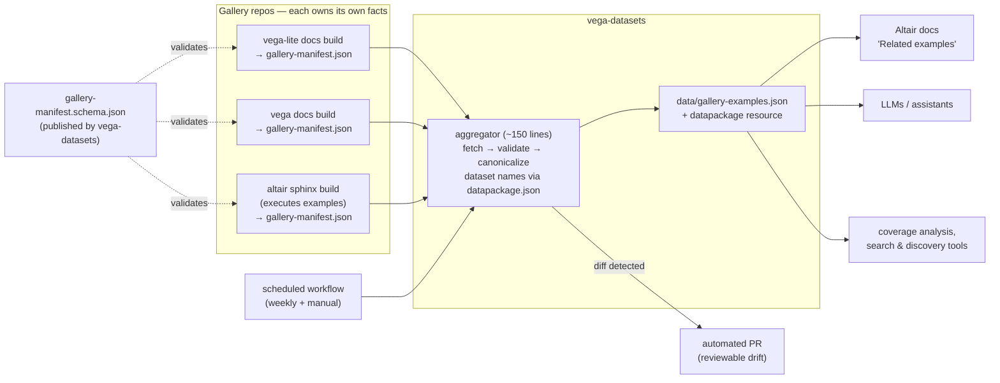

# Design: A Federated Gallery-Examples Index for the Vega Ecosystem

**Status:** Proposal (blue-sky design)
**Context:** [vega/vega-datasets#776](https://github.com/vega/vega-datasets/pull/776) (draft), superseding [#724](https://github.com/vega/vega-datasets/pull/724); related: [vega/altair#4002](https://github.com/vega/altair/issues/4002)
**Date:** 2026-07-19

---

## 1. Problem

There is no machine-readable answer to two symmetric questions:

- *"Which gallery examples use dataset X?"* — needed for "Related examples"
  features in docs (altair#4002), for coverage-gap analysis ("which datasets
  have no examples? which features lack examples?"), and for deciding when a
  dataset can be deprecated.
- *"Which datasets does example Y use?"* — needed by AI assistants and search
  tools to ground generated charts in real, tested examples, and by learners
  browsing by data domain.

PR #776 answers both by **scraping** the three galleries from vega-datasets:
fetch Vega-Lite's and Vega's site index files, list Altair's example directory
via the GitHub API, then regex/heuristic-extract dataset references from specs
and Python source. It works — 399 records today — but the review discussion
surfaced structural tensions worth designing around rather than into:

1. **Fragility by construction.** The scraper parses *presentation-layer*
   artifacts (site `_data/examples.json`, Python docstrings, `# category:`
   comments). Every upstream restructuring is a potential silent breakage,
   which is why the PR grew count-floor canaries, empty-category fallbacks,
   description-rescue logic, and three separate Altair regex families — and
   why the network smoke test had to be removed (expected upstream churn made
   it noisy).
2. **The wrong party does the extraction.** As noted in altair#4002, only
   Altair can reliably compute which datasets its examples use: compiled specs
   inline data as `values`, so the scraper falls back to source-level regex
   over Python conventions. The same is true in kind (if less in degree) for
   Vega-Lite and Vega: the doc builds of those repos already parse every spec;
   the information exists upstream and is re-derived downstream, worse.
3. **Freshness is coupled to vega-datasets releases.** Galleries change
   weekly; vega-datasets releases rarely. A snapshot regenerated manually at
   release time is stale most of its life, and there is no defined process for
   *when* regeneration happens.
4. **Identity is fragile.** `spec_url` as primary key means a branch rename or
   directory move upstream rewrites every key. Meanwhile joelostblom made an
   explicit stability promise about a *different* URL: gallery page URLs
   (`example_url`) will survive reorganization. The design should key on the
   thing upstream promises to keep stable.

## 2. Goals and non-goals

**Goals**

- G1. A queryable example↔dataset index covering Vega, Vega-Lite, and Altair,
  distributed with vega-datasets (npm/jsdelivr/PyPI) like any other resource.
- G2. Extraction accuracy that comes from ground truth (the running doc
  builds), not from pattern-matching presentation artifacts.
- G3. Freshness on the order of days, decoupled from vega-datasets releases,
  with upstream drift surfacing as a *reviewable diff*, not a red CI run or a
  silent regression.
- G4. Stable identity for examples so downstream consumers (Altair docs,
  LLM indexes, bookmarking tools) can hold references across regenerations.
- G5. An incremental migration path: value on day one with zero upstream
  changes, strictly less code as each upstream adopts.

**Non-goals**

- Visualization-technique taxonomy or spec feature detection (deliberately cut
  between #724 and #776; stays cut — categories come from the galleries'
  own curation).
- Indexing third-party galleries or examples that use no vega-datasets data
  (they may appear in upstream manifests; the aggregate records them with an
  empty `datasets` list rather than dropping them — absence of data is itself
  useful for coverage analysis).
- A runtime service. This is a static data artifact; anything live (search
  API, MCP server) is a consumer, not part of this design.

## 3. Proposed architecture: publish manifests upstream, aggregate downstream

Invert the data flow. Instead of vega-datasets reaching *into* three repos and
reverse-engineering their doc builds, each gallery-owning repo **publishes a
small, schema-validated manifest as a byproduct of the doc build it already
runs**, and vega-datasets runs a thin aggregator that validates, canonicalizes
dataset names, merges, and commits.



### Why the boundary sits exactly here

Each side does the one thing only it can do reliably:

- **Upstream repos** know their example inventory, titles, descriptions,
  categories, thumbnails, and — crucially — the *actual* data URLs their
  examples load, computed at build time (Vega-Lite's build parses every spec;
  Altair's sphinx build executes every example, so `chart.to_dict()` yields
  the real URL before any inlining). No regex, no docstring parsing, no
  GitHub-API directory listing.
- **vega-datasets** owns the canonical dataset namespace (`datapackage.json`
  resource names) and is the natural join point. Mapping
  `https://cdn.jsdelivr.net/npm/vega-datasets@3.2.1/data/cars.json` → `cars`
  is the only transformation the aggregator performs on upstream facts.

This directly implements what dsmedia proposed in altair#4002 ("persist the
sphinx-computed metadata to a JSON file so any consumer can map examples
without reimplementing the detection logic") and what joelostblom offered
("happy to reorganize if it helps, provided URLs remain unchanged").

## 4. The manifest contract

A single JSON Schema, `gallery-manifest.schema.json`, versioned and published
from vega-datasets (it can move to a `vega/schemas` home later; the schema
`$id` URL is the contract, not the repo). Draft shape:

```jsonc
{
  "manifestVersion": "1.0",
  "gallery": {
    "name": "altair",                       // enum: vega | vega-lite | altair
    "url": "https://altair-viz.github.io/gallery/",
    "library": "altair",
    "libraryVersion": "6.0.1",              // or commit SHA for site builds
    "generatedAt": "2026-07-18T04:12:09Z"
  },
  "examples": [
    {
      "id": "histogram_heatmap",            // slug, unique within gallery,
                                            // stability promised by the gallery
      "title": "2D Histogram Heatmap",
      "description": "This example shows how to make a heatmap…",
      "categories": ["distributions"],
      "exampleUrl": "https://altair-viz.github.io/gallery/histogram_heatmap.html",
      "specUrl": "https://raw.githubusercontent.com/vega/altair/main/tests/examples_methods_syntax/histogram_heatmap.py",
      "thumbnailUrl": "https://altair-viz.github.io/_images/histogram_heatmap-thumb.png",
      "data": [
        { "url": "https://cdn.jsdelivr.net/npm/vega-datasets@3/data/movies.json",
          "role": "primary" }                // primary | lookup | geo
      ]
    }
  ]
}
```

Design points:

- **`(gallery.name, example.id)` is the global primary key** of the aggregate.
  The slug is derived from the gallery page URL — the identifier upstream has
  promised to keep stable — so keys survive branch renames, directory moves,
  and spec-format migrations that would rewrite every `spec_url`. `specUrl`
  remains a required, unique field (useful for fetching source), it just
  stops being identity.
- **`data[]` carries raw URLs, not vega-datasets names.** Upstream repos
  should not need to know vega-datasets' naming; canonicalization is the
  aggregator's job. Examples using inline or external data simply have fewer
  or zero entries. The optional `role` distinguishes the main table from
  lookup/topo references — cheap for upstream to emit (it knows the context
  in which the URL appeared) and impossible to recover downstream.
- **`thumbnailUrl` is first-class** because the flagship consumer use case
  (altair#4002 "Related gallery examples" sections) needs it, and only the
  gallery build knows where its thumbnails live.
- **Count floors become unnecessary.** A manifest is a complete, upstream-
  asserted inventory; the aggregator validates schema conformance and
  cross-gallery invariants instead of guessing "roughly how many examples
  should exist" (~15% floors in #776).

### Upstream cost, per repo

Each emitter is a ~50-line addition to a build that already computes the data:

- **vega-lite**: the site build already produces `site/_data/examples.json`
  and parses every spec into the example pages; add a jekyll/build step that
  emits the manifest (titles, descriptions, categories, and data URLs pulled
  from the parsed specs — including the "Maps" empty-subcategory case, which
  upstream resolves correctly because it *defined* the convention).
- **vega**: same shape, from `docs/_data/examples.json` plus its spec parses.
- **altair**: exactly the persistence step already proposed in altair#4002 —
  during the sphinx build, each example is executed; serialize
  `chart.to_dict()`-discovered URLs plus the doc metadata into the manifest.

Manifests are committed to each repo (or published with its site), fetched by
the aggregator at a raw URL — one config line per gallery in
`_data/gallery_examples.toml`, as today.

## 5. The aggregator (in vega-datasets)

Replaces the 626-line scraper with roughly:

1. Fetch each configured manifest.
2. Validate against `gallery-manifest.schema.json` (a real JSON Schema
   validation, replacing hand-rolled type guards).
3. Canonicalize each `data[].url` through the datapackage name map (the one
   piece of #776 worth keeping nearly verbatim: `normalize_dataset_reference`
   and `build_name_map`). A URL that prefix-matches vega-datasets but resolves
   to no resource is a **hard error** — that invariant from #776 is exactly
   right, it catches renames on either side.
4. Enforce cross-gallery invariants: `(gallery, id)` uniqueness, `specUrl`
   uniqueness, all configured galleries present, every emitted dataset name
   exists in `datapackage.json`.
5. Emit `data/gallery-examples.json` (flat records, one per example — same
   consumer ergonomics as #776, with `id`, `thumbnail_url`, and per-dataset
   `role` added) and a small provenance block (per-gallery `libraryVersion` /
   `generatedAt`) either as a sidecar or in the datapackage resource metadata.

**Adapter seam for migration.** The aggregator reads per-gallery config:

```toml
[galleries.vega_lite]
adapter = "manifest"     # or "legacy-scrape" until upstream adopts
url = "https://raw.githubusercontent.com/vega/vega-lite/main/site/_data/gallery-manifest.json"
```

`legacy-scrape` adapters are the #776 scraper factored per gallery, each
emitting the *same manifest shape* internally, then flowing through the same
validate → canonicalize → merge pipeline. This means: ship now with three
legacy adapters (identical output to #776 plus the new fields it can fake),
then flip each gallery to `manifest` independently as upstream lands, deleting
its heuristics — Altair's regex family first, since it is the most fragile and
its upstream issue is already primed.

## 6. Freshness: scheduled regeneration as reviewable PRs

A GitHub Actions workflow in vega-datasets, weekly + `workflow_dispatch`:

1. Run the aggregator.
2. If `data/gallery-examples.json` changed, open (or update) an automated PR
   with the diff and a summary comment: examples added/removed/renamed per
   gallery, datasets that gained or lost their last example.
3. If aggregation *fails* (schema violation, unresolvable vega-datasets URL,
   missing gallery), open an issue instead.

This resolves the tension in the PR thread about network tests: dsmedia
removed the smoke test because scheduled checks against live galleries
"generate false alerts during expected restructuring." Under this design,
upstream restructuring is not an alert — it is a diff a maintainer reviews and
merges in thirty seconds. CI for the repo itself stays fully offline (unit
tests on pure functions + schema validation against committed fixtures);
network touches happen only in the scheduled job. The committed
`gallery-examples.json` remains the release artifact, so consumers of
released packages are unaffected by the cadence; consumers who want the
freshest index read the file from `main` via jsdelivr/raw, which the scheduled
PRs keep days-fresh instead of release-fresh.

## 7. Data Package integration

- Register `gallery-examples` as a resource with the full field schema, as
  #776 does, with `primaryKey = ["gallery_name", "example_id"]` and a
  uniqueness constraint on `spec_url`.
- Keep the **flat array-of-records file** as the single distributed artifact.
  A normalized companion (`gallery-example-datasets` join table with
  `example_id` / `dataset_name` / `role` rows) was considered for
  frictionless/SQL friendliness, but the `datasets` array field is the better
  trade: one file, trivially groupable in every consumer language, and the
  join table is a five-line derivation for anyone who needs it. Revisit only
  if a concrete consumer needs relational integrity checks.
- Document the resource in `datapackage.md` with both canonical queries
  ("examples for dataset X", "datasets for example Y") as copy-paste snippets.

## 8. What consumers get

- **Altair docs (altair#4002):** group records by dataset name → "Related
  gallery examples" with titles + thumbnails, replacing ~180 lines of
  heuristic detection. Because Altair itself emits the manifest, its docs
  could even consume its own manifest pre-aggregation and use the aggregate
  only for *cross-library* related examples — a strictly nicer feature.
- **AI assistants / LLM tooling:** stable IDs, descriptions, categories, spec
  URLs, and ground-truth dataset usage in one fetchable file with a published
  JSON Schema — directly indexable, and reliable enough to cite.
- **Maintainers:** the scheduled PR summaries double as a living changelog of
  gallery/dataset coupling: "no example uses `iowa-electricity` anymore" or
  "new dataset `foo` still has zero examples" arrives automatically, which is
  precisely the coverage-gap visibility joelostblom described.

## 9. Rollout

| Phase | Where | Work | Exit criterion |
|---|---|---|---|
| 0 | vega-datasets | Land #776 refactored into the adapter pipeline: three `legacy-scrape` adapters + shared validate/canonicalize/merge core; add `(gallery, id)` keys (slug from `example_url`), schema file, scheduled-PR workflow | Index ships; freshness automated |
| 1 | vega-datasets | Publish `gallery-manifest.schema.json` v1.0 with docs for gallery implementers | Schema URL stable |
| 2 | altair, vega-lite, vega | Upstream PRs adding manifest emission to doc builds (altair first — altair#4002 is already the same ask) | Each repo publishes a valid manifest |
| 3 | vega-datasets | Flip adapters to `manifest` per gallery as upstream lands; delete that gallery's heuristics | All galleries on manifests; scraper code gone |

Phase 0 alone is a strict improvement over #776 (stable identity, automated
freshness, schema-validated pipeline) and requires nothing from anyone
upstream. Every later phase deletes code.

## 10. Alternatives considered

- **Keep pure scraping (#776 as-is).** Ships fastest; permanently carries the
  fragility taxes documented in its own commit history (count floors,
  fallbacks, regex families), and every upstream restructuring is a
  vega-datasets maintenance event forever.
- **A dedicated `vega/gallery-index` repo.** Cleanly decouples cadence and
  keeps generated bulk out of vega-datasets, but the aggregator's only real
  logic is canonicalization against `datapackage.json`, which lives here; a
  new repo adds governance overhead and hurts discoverability (consumers
  already fetch vega-datasets). Revisit if the index grows beyond the Vega
  org's own galleries.
- **Central extraction from compiled specs** (aggregator compiles/executes
  examples itself, e.g. running Altair code). Maximum accuracy without
  upstream buy-in, but importing three ecosystems' toolchains into
  vega-datasets CI is far more machinery than three 50-line upstream emitters,
  and it still re-derives what upstream builds already know.
- **Per-example records embedded in `datapackage.json` resources** (each
  dataset lists its examples). Rejected: inverts the natural direction of the
  facts, bloats the package descriptor, and loses example-level metadata.

## 11. Open questions

1. Should the schema live at a `vega.github.io/schema/gallery-manifest/v1.json`
   style URL (matching `vega-lite/v6.json` conventions) from day one? Cheap to
   do, and makes the contract feel ecosystem-owned rather than
   vega-datasets-owned.
2. `role` vocabulary: is `primary | lookup | geo` sufficient, or should it
   stay open-ended (string with recommended values) for v1?
3. Do we want the scheduled job to also publish the aggregate to the
   `vega-datasets` GitHub Pages site as a stable "latest" URL, or is
   raw-from-`main` via jsdelivr sufficient? (Recommend the latter until a
   consumer asks.)
